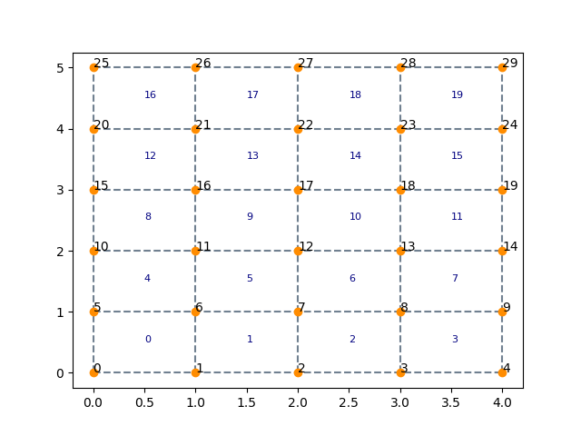

# FEM for Python
This project is my implementation of FEM for structures as part of my coursework in MSc Civil and Water Engineering at Cardiff University
This is a project under developement.

## [meshgenerator.py](meshgenerator.py)
Contains all the classes for mesh generation
- [x] uniform grid generation based on boundary points
- [ ] uniform grid generation based on input vertices
- [ ] mesh generation using Delaunay Tringulation

